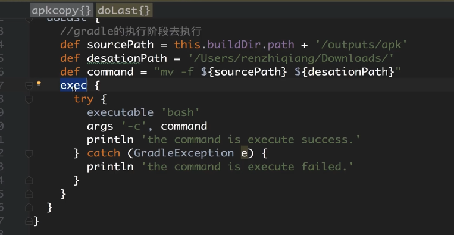

在gradle中，如果需要执行命令，有三种方式可以实现
* 命令字符串执行： "xxx".execute()
* 命令任务执行：task xxx(type: Exec) {}
* gradle执行命令闭包：exec {}

下面就详细的介绍一下，这三种方式的具体实现
### 1、命令字符串执行：

**代码**："xxx".execute()

**解释**： "xxx" 就是需要执行的命令，比如 svn --version，git --version，java -version，cmd dir 等等，直接将需要执行的命令用字符串表示后调用 .execute() 方法，这个命令就可以执行了。

**切记**： 虽然这种方式很简单，但也很有多问题：
* 你要执行的这条命令必须在你电脑里配置了相关的环境变量，否则会报系统找不到指令的错误。

案例：
``` java
task exeOrder() {
    group 'order'
    // 执行命令：java --version，并拿到输出的信息：text
    println "java --version".execute().text
}
```

**注意：** 这里我们执行了java 查看版本好的命令，在命令行中，我们直接执行：**java -version** 就可以查看了，但在gradle中执行时，需要两个横杠‘--’，才会有输出信息。

命令的执行，除了可以在task中执行，也可以在方法中执行：
``` java
def executeOrder() {
    println('开始执行java 命令')
    println 'git --version'.execute().text
    println('命令执行结束')
}
```
输出信息：
``` java
开始执行java 命令
git version 2.20.1 (Apple Git-117)

命令执行结束
```


**执行git命令：**

```groovy
//定义Git语句
def statusPro = "git status".execute() // 执行命令字符串
//打印Git命令的结果，一开始就是不知道有这个，执行不成功也没有日志输出，走了很多弯路
println "git status:\n" + statusPro.inputStream.text
statusPro.waitFor()// 等待命令执行完成
    
def pullPro = "git pull".execute() // 执行pull命令
println "git pull:\n" + pullPro.inputStream.text // 输出日志
pullPro.waitFor() // 等待执行完成
```


### 2、命令任务执行命令：

**命令**：task xxx(type: Exec) {}

**解释**：这种方式是官方给的教程里介绍的方式，[官方链接跳转](https://docs.gradle.org/current/dsl/org.gradle.api.tasks.Exec.html)

``` java
// 任务必须要指定类型为：Exec，否则执行命令会报错
task exeOrder(type: Exec) {
    group 'order'

    // 指定工作路径为根目录
    workingDir rootDir
    commandLine 'java', '-version'

    // commandLine 'git', '--version'
}
```
输出：

``` java
java 12.0.2 2019-07-16
Java(TM) SE Runtime Environment (build 12.0.2+10)
Java HotSpot(TM) 64-Bit Server VM (build 12.0.2+10, mixed mode, sharing)
```

**解释**：通过 Gradle 提供好的类型为 Exec 的 task，然后通过配置工作路径 workingDir, 需要执行的命令 commandLine，一个 Gradle 脚本就好了，然后通过 android studio 提供的 ui 界面执行或者 Gradle 的命令行形式直接执行这个 task 即可。

### 3、gradle执行命令闭包：exec {},执行命令
**命令**：exec {}

**解释**：这个命令的用法可以说跟 第二种方式 一样，我个人针对这两个的区别理解就是，第二种方式必须通过特定类型的 task 方式去执行一个命令，但 exec{} 的方式可以通过方法也可以通过 task 方式，比较灵活。

案例：

1.在任务中，执行 exec{} 闭包

``` java

task exeOrder() {
       group 'order'
       //设置命令执行结果的输出的地方
       def out = new ByteArrayOutputStream()

       exec {
           commandLine 'java', '-version'

           // commandLine 'git', '--version'

           standardOutput out
       }
       return out
   }
```
2.也可以在方法中执行：exec{} 闭包
``` java
def execTest() {
    exec {
        commandLine 'java', '--version'

        // commandLine 'git', '--version'
    }
    println '命令执行结束'
}
```
输出：
``` java
java version "12.0.2" 2019-07-16
Java(TM) SE Runtime Environment (build 12.0.2+10)
Java HotSpot(TM) 64-Bit Server VM (build 12.0.2+10, mixed mode, sharing)
命令执行结束
```




```
class PublishAppTask extends DefaultTask {

    PublishAppTask() {
        group = "wangzhi"
        dependsOn "build"
    }

    @TaskAction
    void doAction() {
        //打包已完成

        //这里的路径其实是不严谨的·
        def oldApkPath = "${project.getBuildDir()}/outputs/apk/release/app-release.apk"

        //获取参数
        def qihuPath = project.extensions.publishAppInfo.qihuPath
        def keyStorePath = project.extensions.publishAppInfo.keyStorePath
        def keyStorePass = project.extensions.publishAppInfo.keyStorePass
        def keyStoreKeyAlias = project.extensions.publishAppInfo.keyStoreKeyAlias
        def keyStoreKeyAliasPass = project.extensions.publishAppInfo.keyStoreKeyAliasPass
        def apkOutputDir = project.extensions.publishAppInfo.outputPath
        //360加固-登录
        execCmd("java -jar ${qihuPath} -login userName pass")
        //360加固-签名信息配置
        execCmd("java -jar ${qihuPath}  -importsign ${keyStorePath} ${keyStorePass} ${keyStoreKeyAlias} ${keyStoreKeyAliasPass}")
        //360加固-渠道信息配置
        execCmd("java -jar ${qihuPath} -importmulpkg ${project.extensions.publishAppInfo.channelPath}")
        //360加固-开始加固
        execCmd("java -jar ${qihuPath} -jiagu ${oldApkPath} ${apkOutputDir} -autosign  -automulpkg")
        println "加固完成"
    }

    void execCmd(cmd) {
        project.exec {
            executable 'bash'
            args '-c', cmd
        }
    }
}
```


参考博客：

* https://www.cnblogs.com/dasusu/p/9095738.html
* https://www.jianshu.com/p/36ecd23191d2
